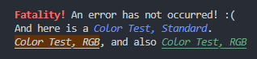

# Escape the ANSI Escape Code hellhole

This project aims to provide small, easily mantainable "libraries" allowing developers to add some flair to their CLI apps through ANSI Escape Codes (AEC) without the need to manually manage those codes.

## Languages

**Not** in alphabetical order **nor** by preference:

  - [ ] **[WIP]** sh &mdash; command language:
    - [X] zsh
    - [ ] Bash
  - [X] C
  - [X] C++20
  - [X] Python 3
  - [X] OCaml
  - [X] Pascal
  - [X] Delphi (Object Pascal)
  - [ ] **[WIP]** C#
  - [ ] Java
  - [ ] Kotlin
  - [ ] Swift
  - [ ] Haskell
  - [ ] Rust


## The codes

The ANSI Escape Codes used in Control Sequence Introducers can be found in [AEC.md](AEC.md).


## Examples

Expected output:



### zsh

```sh
echo "$(font bold fg_red)Fatality!$(font reset) An error has not occurred :("
echo "And here is a $(font italic fg 69)Color Test, Standard$(font reset)."
echo "$(font italic underline bg 100 50 9)Color Test, RGB$(font reset), and also $(font underline italic fg 9 100 50)Color Test, RGB$(font reset)"
```

To be used, it is recommended to place [`escape.zsh`](sh/zsh/escape.zsh) in a folder like `~/.zshrc.d` and add the following to `.zshrc`:

```sh
source ~/.zshrc.d/escape.zsh
```

*Escape* is used in the [*zshrc* project](https://github.com/ibnunes/zshrc), being directly provided by it. It can be out-of-date, however, since the two projects are independent and thus have different workflows.


### Python 3

```python
from escape import Ansi.escape as font

# With formatted strings
print( f"{font('bold', 'fg_red')}Fatality!{font('reset')} An error has not occurred :(" )
print( f"And here is a {font('italic', 'fg', 69)}Color Test, Standard{font('reset')}." )

# And with the str.format method
print( "{1}Color Test, RGB{0}, and also {2}Color Test, RGB{0}".format(    \
    font('reset'),                                                        \
    font('italic', 'underline', 'bg', 100, 50, 9),                        \
    font('underline', 'italic', 'fg', 9, 100, 50) ) )
```


### C

```c
#define __FONT_AS_ANSI_ESCAPE__
#include "escape.h"
#include <stdio.h>

int main(void) {
    printf("%s%s%s\n", font(BOLD, FG_RED), "Fatality!", nofont);
    printf("%s%s%s%s%s\n", "And here is a ", font(ITALIC, FG(69)), "Color Test, Standard", nofont, ".");
    printf("%s%s%s%s%s%s%s\n", font(UNDERLINE, ITALIC, BG(100, 50, 9)), "Color Test, RGB", nofont, ", and also ", font(ITALIC, FG(9, 100, 50), ITALIC), "Color Test, RGB", nofont);
    return 0;
}
```


### C++20

  * `Ansify<codes...>("string")`: Works with any string in runtime;
  * `AnsifyS<length, codes...>("string")`: Run in compile-time, needing the exact length of the string as first template parameter (excluding `\0`) &mdash; reads as "*Ansify Static*".

No version is currently available for previous C++ standards. See at the end how to contribute.

```cpp
#include "escape.hpp"
#include <iostream>

using namespace std;
using namespace Ansi;

int main(void) {
    cout << AnsifyS<9, Code::BOLD, Code::FG_RED>("Fatality!") << " An error has not occurred :(" << endl;
    cout << "And here is a " << Ansify<Code::ITALIC, Color::FG<69>>("Color Test, Standard") << "." << endl;
    cout << AnsifyS<15, Code::UNDERLINE, Color::BG<100, 50, 9>, Code::ITALIC>("Color Test, RGB") <<
        ", and also " << Ansify<Code::ITALIC, Code::UNDERLINE, Color::FG<9, 100, 5>>("Color Test, RGB") << endl;
    return 0;
}
```


### OCaml

```ocaml
open Escape

let () =
  let () = ansify [Bold; Fg_Red] "Fatality" ^ " An error has not occurred :(" |> print_endline in
  let () = "And here is a " ^ ansify [Italic; Fg 69] "Color Test, Standard" ^ "." |> print_endline in
    ansify [Underline; Italic; Bgx (100, 50, 9)] "Color Test, RGB" ^ ", and also " ^ ansify [Fgx (9, 100, 50); Underline; Italic] "Color Test, RGB" |> print_endline
```


### Pascal

```pascal
{$mode objfpc}
program test;
uses escape;

begin
    writeln( Ansify([BOLD, FG_RED], 'Fatality!'), ' An error has not occurred! :(' );
    writeln( 'And here is a ', Ansify([ITALIC, FG, 69], 'Color Test, Standard'), '.' );
    writeln( Ansify([UNDERLINE, BG, 100, 50, 9, ITALIC], 'Color Test, RGB'), ', and also ', Ansify([UNDERLINE, FG, 9, 100, 50, ITALIC], 'Color Test, RGB') );
end.
```


### Delphi (Object Pascal)

Tested in Free Pascal Compiler, version 3.2.2.
```delphi
{$mode delphi}
program test;
uses escape;

begin
    writeln( Ansify([BOLD, FG_RED], 'Fatality!'), ' An error has not occurred! :(' );
    writeln( 'And here is a ', Ansify([ITALIC, FG(69)], 'Color Test, Standard'), '.' );
    writeln( Ansify([UNDERLINE, BG(100, 50, 9), ITALIC], 'Color Test, RGB'), ', and also ', Ansify([UNDERLINE, FG(9, 100, 50), ITALIC], 'Color Test, RGB') );
end.
```


## License

The software is provided without warranty and as is under the [GNU General Public License version 2](LICENSE.md).


## Roadmap

**Notice!** This section can be expanded without prior notice.

  - [ ] **[WIP]** Add fundamental function to apply AECs to the languages in the list.
  - [ ] Add support to interpolated AECs.
  - [ ] Add support to more CSIs (Control Sequence Introducers).


## Contribute

**Notice!** This section can be expanded as needed without prior notice.

These are the current guidelines for contribution:

  1. Contributions shall be provided via forks.
  2. All [AEC descriptors](AEC.md) must be the same across supported languages as long as it is feasible or possible.
  3. Each supported language must have at least one dedicated branch.
  4. The branch `dev` is to have the current status of all supported languages.
  5. Changes to be merged to `main` are to be done exclusively through Pull Requests.
